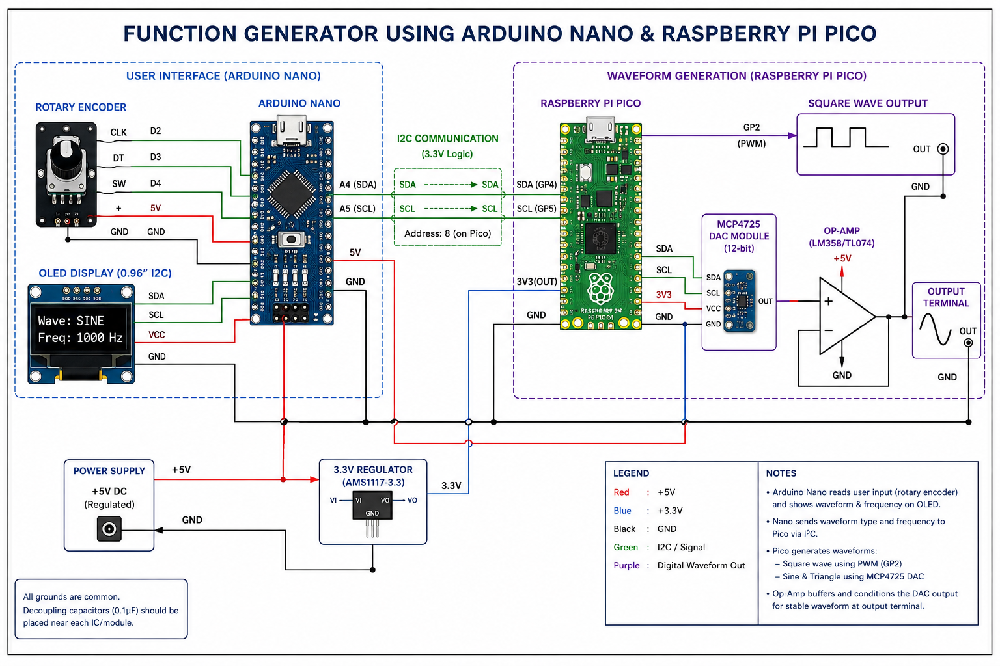

# Function Generator using Arduino Nano & Raspberry Pi Pico

## Overview
This project implements a low-cost function generator capable of generating:

- Square wave
- Sine wave
- Triangle wave

Waveform type and frequency are controlled using a rotary encoder and displayed on an OLED display. Arduino Nano manages user input and communication, while Raspberry Pi Pico generates waveforms.

---

## Features

✔ Adjustable frequency control  
✔ Multiple waveform generation  
✔ OLED display interface  
✔ Rotary encoder input  
✔ I2C communication between Nano and Pico  
✔ DAC based analog waveform generation  

---

## Components Used

| Component | Purpose |
|-----------|----------|
| Arduino Nano | User input & OLED control |
| Raspberry Pi Pico | Waveform generation |
| MCP4725 DAC | Digital to analog conversion |
| Rotary Encoder | Frequency / waveform selection |
| OLED Display | Display waveform & frequency |
| LM358 / TL074 | Signal conditioning |
| Breadboard + wires | Connections |

---

## Working Principle

1. User changes waveform/frequency using rotary encoder.
2. Arduino Nano updates OLED display.
3. Nano sends settings to Raspberry Pi Pico using I2C.
4. Pico generates waveform.
5. MCP4725 converts digital signal into analog waveform.
6. Op-Amp conditions output signal.

---

## Circuit Diagram

(Add schematic image here)

## Circuit Diagram

## Hardware Implementation

(Add breadboard image here)

---

## Output Waveforms

### Square Wave Output

(Add oscilloscope image)

### Triangle Wave Output

(Add oscilloscope image)

---

## Folder Structure

Code/ → Source code files

Circuit/ → Schematic and hardware images

Output/ → Oscilloscope outputs

---

## Future Improvements

- Higher waveform accuracy
- PCB implementation
- Better frequency range
- Additional waveform support

---

## Authors

Vishal Yadav and team  
St. Francis Institute of Technology, Mumbai
